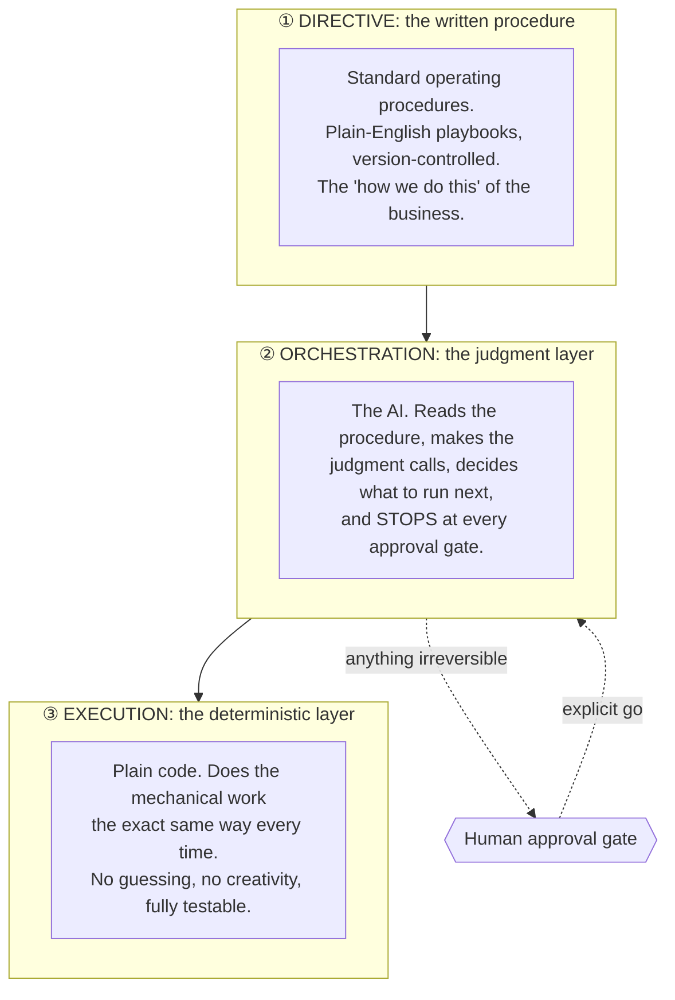

# Case Study: Why the System Doesn't "Just Prompt an AI"

> The architecture that makes an AI-run business trustworthy: push every repeatable decision into deterministic code and written procedure, let the AI handle only judgment, and put a human gate on anything irreversible. Here's the design and why it matters if you're a business owner deciding whether to trust this stuff.

**Author:** Paul Arceneaux, founder of [Snap2Flow](https://snap2flow.com)
**What this is:** A plain-language explanation of an architecture pattern. No source code is published here.

---

## The problem

The default way people build with AI is to write one big prompt and hope the model does the right thing every time. That feels fast. It's also the reason so many "AI automations" quietly break.

Here's the math that kills them. Suppose your AI gets each step 90% right, genuinely good for an open-ended model. String five steps together and the odds the *whole thing* is right are 0.9 × 0.9 × 0.9 × 0.9 × 0.9 ≈ **59%**. A five-step process that fails four times out of ten isn't an automation. It's a liability, especially when one of those steps sends a client an email or moves money.

If you own a business, this is the real question behind "should I trust AI with this?" It's not *is the AI smart enough*; it's *what happens on the 1-in-10 that goes wrong, and does it go wrong somewhere expensive?*

## The approach

I don't ask the AI to do everything. I split every workflow into three layers, and I'm deliberate about what lives in each.

**① Directive: the written procedure.** Every repeatable workflow is documented as a standard operating procedure, the same way a well-run company writes down how it does things. These are plain-English, version-controlled, and they're what an agent reads before acting, like handing an employee the playbook instead of expecting them to improvise.

**② Orchestration: the judgment layer.** This is where the AI lives, and *only* where it lives. It reads the procedure, makes the calls that genuinely need judgment ("is this proposal ready?", "which angle fits this prospect?"), decides what to run next, and it stops at every gate that touches the outside world.

**③ Execution: the deterministic layer.** The mechanical work (formatting a document, updating a record, sending data to a service, scoring a list against a rubric) is done by plain, ordinary code. Code doesn't get creative. Run it a thousand times, you get the same result a thousand times. It's testable, auditable, and boring in exactly the way you want the load-bearing parts of a business to be boring.

**The principle:** push complexity *down into code and procedure*, so the AI is left with the small set of decisions that actually require a mind. The less you ask a probabilistic system to do, the more reliable the whole thing becomes.

## How it works in practice

Take "send a client proposal." A naive single-prompt version asks the AI to do all of it: gather the inputs, write every section, format the document, and send it. Four chances to go subtly wrong, including the last one, where wrong means an unfinished proposal lands in a client's inbox.

The three-layer version:

1. **Directive:** a proposal procedure spells out the required sections, the pricing rules, the structure.
2. **Orchestration:** the AI runs an intake conversation, drafts the parts that need real writing, and has a second agent grade the draft, pure judgment work.
3. **Execution:** deterministic code assembles the final branded document from those approved parts, identically every time. No "creative" formatting, no drifting layout.
4. **Gate:** the finished proposal stops. It is **never** sent until I review it and say "go."

The AI does what it's good at: reading, writing, judging. Code does what *it's* good at: exact, repeatable mechanics. And a human owns the irreversible moment.

## What's under the hood

- **A standing list of gated actions.** Sending a proposal, sending any email, creating or sending an invoice, activating an outreach campaign, importing a contact list, deploying anything public, spending money outside a short pre-approved list: each is a hard stop that waits for explicit approval. "When in doubt, show a preview and wait" is the default, not the exception.
- **A short whitelist for routine spend.** A handful of metered services are pre-approved for ordinary day-to-day use so the system isn't constantly interrupting me over a few cents. Anything outside that list stops and asks. The gate is calibrated to *risk*, not to bureaucracy.
- **Self-correction at the execution layer.** When deterministic code hits an error, the failure is specific and legible: a stack trace, not a vague "the AI got confused." The fix is targeted, gets tested, and the lesson is written back into the procedure so it doesn't recur. Probabilistic failures are hard to debug; deterministic ones aren't.
- **Procedures that improve themselves.** As edge cases surface (an API limit, a timing quirk, a format gotcha), they get captured in the written directive. The system's "how we do it" gets sharper with use instead of staying frozen.

## Results

- **Reliability that compounds the right way.** By keeping the AI's surface area small and handing the repeatable mechanics to code, multi-step workflows hold together instead of degrading step by step.
- **A clear, auditable trail.** Because the mechanical work is deterministic, I can point at exactly what happened and why, not shrug at a black box.
- **Trust where it counts.** Every step that touches a customer or a dollar has a human gate. The system is autonomous up to the edge of anything irreversible, and then it stops.
- **This isn't theory.** It's the architecture under a [full AI operations org](https://github.com/paularceneaux/case-study-ai-operations-org): 8 departments and 20+ agents, running a real consultancy today.

## Where this fits

When a business owner asks me "can I actually trust AI to run part of my operation?", this is my answer. You don't trust the *model*; you trust the *architecture around it*: judgment to the AI, mechanics to deterministic code, and a human in command of anything that can't be undone. That's the difference between a flashy demo and a system you can put real work through.

**Snap2Flow** builds enterprise-grade automation and AI systems for small and mid-sized businesses. → [snap2flow.com](https://snap2flow.com) · [LinkedIn](https://www.linkedin.com/in/paularceneauxofficial/)

---

*This case study describes a production architecture in narrative form. It intentionally does not publish the underlying source code, procedures, or any client information.*
